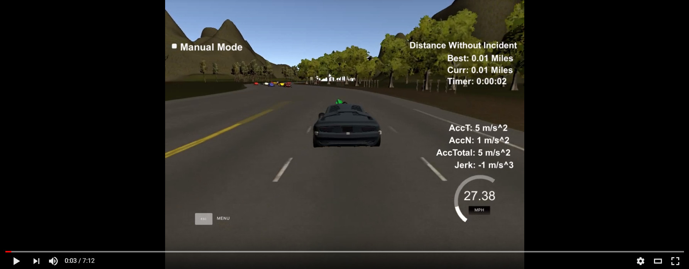
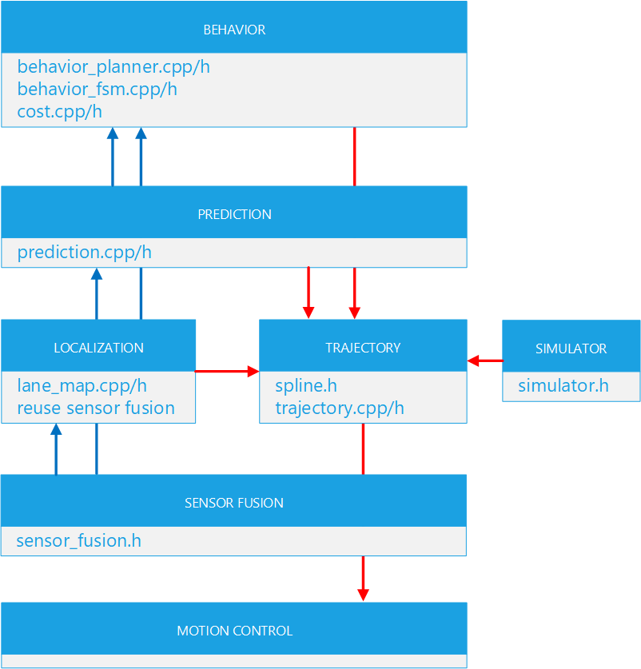
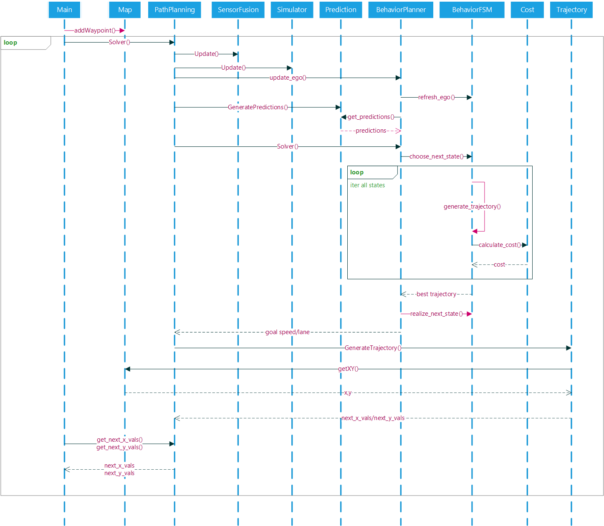

# CarND-Path-Planning-Project
Self-Driving Car Engineer Nanodegree Program
   
---
## 1. Output Video

Performance: It varies according to traffic conditions.

## 2. Implementation

At first, I followed the Q&A video to finish a basic version. Then I separated the full main.cpp to many small files based on this. I use the Q&A solution for trajectory generating. I also reused the class offered source code, but changed a lot. 

### 2.1. File Structure

In order to make the architecture clear and consistent with the framework provided by the course. I spent a lot of time splitting the entire project into smaller modules and trying to make each submodule independent. The following figure is the corresponding file for each module.

### 2.2. Execute Sequence 

The following figure is a simplified execution sequence diagram of the entire system.

## 3. Prediction

In this project, although I wrote the prediction module, I only reused the data obtained from sensor fusion and did not predict the position of the car at the next time. But this module already provides all the functionality for predicting the next position.

## 4. Behavior Planning

In this module I reuse the sample provided by the course. And it retains five states's state machine. I don't handle behavior planning like the Q&A provided from end_path_s, but from the car's current location. 

The most time-consuming here is the debugging of cost funtions. I use 5 kinds of cost funtions, each one for a certain kind of case. Work together to get the best value. However, there are still many cases that cannot be covered. Later, for stability, I removed the lane_change_cost, so there are only four.

- lane_change_cost: is mainly used to return the car to the middle lane after each overtaking so that there are three lanes available for the next lane change.
- lane_keep_cost: if there is a car within the safe distance of the lane to be converted, I think it is better to stay in the current lane.
- inefficiency_cost: it is always best to keep the top speed.
- collision_cost: it is the most important to avoid collisions. There are different costs depending on the distance.
- traffic_cost: sometimes, if there are three cars side by side in the front of three lanes, or if there are cars all around, I think it is best to stay in the current lane and follow the car ahead.

## 5. Trajectory Generation

Here I used the spline curve fitting method provided by Q&A and made minor modifications. Different acceleration increments are provided for different situations. For example, at startup, we need to quickly accelerate the maximum value. Or suddenly there is a car in the front, I will empty all the paths and keep the last three for smoothing. In another case, ego will continue to cross two lanes. At this time, the acceleration increment must be kept within a certain range so that no alarm is generated.

One key that cannot be ignored is that, at the end of each lap, the mileage will change from the largest to the smallest, so that the acceleration becomes very large. To deal with this problem, after the last 50 meters is detected, slowly decelerate through the nodal area with minimal acceleration based on the speed of the current car.

## 6. Conclusion

This project is the hardest thing I've done so far. I can't understand many concepts at the beginning. I don't know how to apply the concepts in the curriculum to this project. Especially after reading Q&A, I'm even more confused. Later, I gradually transferred each module, and then I was able to make huge gains at each step when the car was able to keep lanes, change lanes, and continue to operate for a long time. I have read that many students use a very small amount of code to complete the project in a very efficient way and have a better effect. However, I still want to use a lot of code to learn the framework and learn C++. Even if it seems heavy, I have gained more. There are some cases in this project that may not be fully covered in the limited tests, but for the moment I am getting fairly acceptable results.

